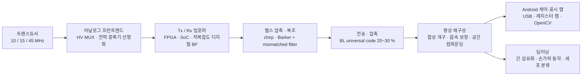

  

  
  
  
  
  
  

# MITS LAB · 인제대학교 의료 초음파 연구실

**Biomedical Ultrasound Laboratory, Inje University (PI: Prof. Changhan Yoon)**

초음파가 몸 안으로 들어가서 영상이 되어 나오기까지의 전 구간을 다룹니다. 트랜스듀서와 아날로그 프런트엔드, 송수신 빔포밍과 펄스 압축, 데이터 전송과 압축, 영상 재구성, 그리고 그 위에 얹는 딥러닝까지. 진단 영상(B-mode·광음향·고주파 초음파)뿐 아니라 세포 하나를 붙잡는 음향 집게(acoustic tweezers)와 치료 초음파(HIFU·LIPUS)까지 같은 물리 위에서 연구합니다.

> 하드웨어 한 장(FPGA·SoC)으로 돌아가는 휴대용 초음파 시스템을 만들던 계보에서 출발해, 지금은 **고주파 초음파 시스템·광음향 영상·초음파 마이크로빔·AI 기반 초음파 진단**으로 확장하고 있습니다.

---

## 숫자로 보는 연구실

| 지표 | 값 | 비고 |
|---|---|---|
| 총 피인용 | **1,619** | Google Scholar, 2026-09 기준 |
| 2021년 이후 피인용 | 900 | 최근 5년 |
| h-index / i10-index | **24** / 38 | 최근 5년 18 / 29 |
| 가장 많이 인용된 논문 | 182회 | *A single FPGA-based portable ultrasound imaging system for point-of-care applications*, IEEE TUFFC 2012 |
| 학습 데이터 규모(AI 초음파) | 7,920장 / 933명 | 두 대학병원 간 섬유화 B-mode 영상, BMC Medical Imaging 2024 |
| 다루는 주파수 대역 | 0.5 MHz ~ 45 MHz+ | 진단·치료용 저주파부터 안과·피부·세포용 고주파까지 |

---

## 연구 분야

### 1. 초음파 영상 시스템과 빔포밍
저비용·소형 시스템에서 상용기 수준의 화질을 내는 것이 목표입니다. FPGA 한 개로 동작하는 휴대용 초음파 시스템(IEEE TUFFC 2012, 피인용 182), point-of-care용 SoC 솔루션(IEEE TBCAS 2016), 초소형 시스템을 위한 shared-FIFO 병렬 빔포밍, 고주파 영상용 저복잡도 디지털 빔포머 아키텍처를 개발해 왔습니다.

- **펄스 압축** — chirp 코드 여기의 효율적 압축법(IEEE TUFFC 2013). 최근에는 Barker 코드 여기에서 mismatched filter를 RF가 아닌 decimation된 IQ baseband에 적용해 **하드웨어 복잡도를 L²배 절감**하면서 −6 dB 축방향 해상도를 그대로 유지하는 방법을 휴대용 시스템에 구현·검증(Ultrasonography 2026).
- **합성 개구 영상** — 양방향 픽셀 기반 포커싱(IEEE TBME 2013). 고주파 convex 어레이 + 가상 음원 합성 개구(SA-VS)로 안과 영상에서 **측방 해상도 10 % 이상, 사이드로브 4.4 dB 이상 개선, 침투 깊이 16 → 23 mm** (Sensors 2021, 자체 제작 64채널 시스템).
- **음속 추정·보정** — minimum average phase variance 기반 평균 음속 추정(Ultrasonics 2011), 광음향 영상의 음속 보정(Optics Express 2012).
- **데이터 전송·압축** — 소프트웨어 기반 초음파 시스템의 병목인 센서→시스템 전송률을 줄이기 위한 Binary cLuster 범용 부호. 보조 메모리 없이 실시간 인코딩·디코딩으로 **20~30 % 무손실 압축**(Sensors 2018).
- **적응 복조** — 의료 초음파용 adaptive dynamic quadrature demodulation(JEET 2018).

### 2. 고주파 초음파와 마이크로빔 (acoustic tweezers)
15 MHz를 넘는 고주파 초음파는 해상도를 세포 수준으로 끌어올립니다. 45 MHz PMN-PT 단일 소자 혈관 내 초음파 트랜스듀서(Sensors & Actuators A 2015), 고주파 어레이로 여러 입자를 동시에 포획·조작(Applied Physics Letters 2014), 초고주파 단일 빔 음향 집게의 포획력 보정(IEEE TUFFC 2016), 포획된 미세입자의 운동 추적으로 성능 평가(JJAP 2018).

- 단일 빔 음향 집게로 **세포 역학 측정**(Microsystems & Nanoengineering 2020), 초음파 자극에 의한 췌장 β세포의 세포 내 Ca²⁺ 진동 규명(Cells 2020), 고주파 어레이 스펙트럼 분석으로 적혈구 응집 평가(BEL 2017).
- 영상에서 자극·딥러닝 결합까지 고주파 초음파의 최근 흐름을 정리한 리뷰(Sensors 2024).

### 3. 광음향 영상과 조영
레이저로 활성화되는 perfluorohexane 나노드롭릿을 조영제로 쓰는 생체 내 조영 증강 초음파(Medical Physics 2017)와, 그 나노드롭릿을 초고속 초음파로 국소화하는 **초해상도 영상**(IEEE TUFFC 2018). 유방 미세석회화의 광음향 영상 검증 연구(Journal of Biophotonics 2015).

### 4. 치료 초음파와 세포·약물 전달
HIFU와 LIPUS. 성장 인자 방출 고분자 나노입자와 초음파 자극의 골분화 상승 효과(Pharmaceutics 2021), 프로토타입 초음파와 PLGA 입자를 결합한 단백질 전달(Pharmaceutical Research 2021), 고주파 초음파 국소 처치에 의한 조직 내 항원 유지 증대(BEL 2025). 영상 유도 치료를 위한 조절 초점 HMD(Computer Assisted Surgery 2017)와 유방 바늘 생검용 CMOS 고전압 1-64 멀티플렉서(IEEE TUFFC 2018)처럼 시술 장비 쪽도 다룹니다.

### 5. AI × 초음파
초음파는 검사자 의존성이 큰 영상입니다. 그 해석을 자동화합니다.

- **간 섬유화 단계 자동 분류** — 조직검사로 확정한 METAVIR 점수(F0~F4, 5단계)를 B-mode 영상에서 예측. 두 대학병원 933명, 7,920장으로 VGGNet·ResNet·DenseNet·EfficientNet·ViT를 비교해 **평균 AUC 0.95~0.96, 정확도 0.94, 특이도 0.96**(BMC Medical Imaging 2024, 피인용 55). 이기종 초음파 영상 간 일반화는 IEEE Access 2023.
- **전완 초음파 기반 손가락 동작 인식** — sEMG의 한계를 B-mode 영상으로 대체. 단일·복합 손가락 동작 9종을 딥러닝으로 분류해 **정확도 95.64 %, F1 0.9563**(Scientific Reports 2025). VR 제스처·의수 제어로 이어지는 방향.

---

## 시스템 스택 — 트랜스듀서에서 딥러닝까지

---

## 저장소

| 저장소 | 무엇인가 | 스택 |
|---|---|---|
| [`mits-rust-multiplatform-sdk`](https://github.com/INJE-MITS/mits-rust-multiplatform-sdk) | 고성능 신호처리 메소드를 **Rust 한 곳에 구현하고 Kotlin·Python·Swift·Wasm으로 네이티브 바인딩을 생성**하는 SDK 빌드 시스템. UDL 한 파일로 FFI 계약을 선언하면 `build.rs`가 scaffolding을 만들고, 빌드 스크립트가 Android 4개 ABI(arm64-v8a·armeabi-v7a·x86·x86_64)의 `.so`와 Kotlin 바인딩을 앱 프로젝트에 주입한다. GitHub Actions CI 포함. | Rust 2021 · uniffi 0.25 · cargo-ndk · Kotlin |
| `MITS_UltraSound_Android` *(private)* | 자체 제작 초음파 프런트엔드 보드를 **USB bulk 전송으로 제어하고 B-mode 영상을 실시간 표시**하는 Android 앱. Excel 레지스터 맵(Tx/Rx 빔포머 지연 계수·TGC·apodization, 10/15 MHz LUT)을 파싱해 보드 레지스터에 기록하고, 1024×128 프레임을 26-bit 동적 범위에서 50 dB 로그 압축 후 5각도 OpenCV affine warp로 공간 컴파운딩한다. Java 약 3,100줄 + OpenCV native. | Android · Java · OpenCV (C++/JNI) · USB Host |

두 저장소는 하나의 방향을 향합니다. 신호처리 커널은 Rust로 한 번만 쓰고, 그것을 태블릿·데스크톱·브라우저 어디서든 같은 성능으로 돌리는 것.

---

## PI · 윤창한 (Changhan Yoon)

| | |
|---|---|
| 소속 | 인제대학교 (2016 ~ ) · 의료 영상 및 초음파 치료 시스템 |
| 학위 | 서강대학교 전자공학 학사 · 석사(2009) · 박사(2013) |
| 경력 | 서강대학교 연구원(2013) → University of Southern California, NIH Resource Center for Medical Ultrasonic Transducer Technology, Postdoctoral Research Associate(2013 ~ 2015) → Georgia Institute of Technology, Ultrasound Imaging and Therapeutics Research Laboratory, Postdoctoral Fellow(2016) → 인제대학교 |
| 관심 분야 | Medical ultrasound / photoacoustic imaging & systems · HIFU / LIPUS · micro-ultrasound imaging systems · acoustic tweezers · wearable ultrasound |
| 편집 활동 | *Sensors* Special Issue "Imaging Sensors and Applications" 공동 편집, *Photonics* Special Issue "Photoacoustic Imaging and Systems" Guest Editor |
| 강의 | 의학물리 · 의료기기 개론 · 바이오 신호처리 · 의료 영상 처리 · 초음파 공학 특론 · 모바일 디바이스 기반 의용 앱 설계 |
| 연락 | yoonch80@gmail.com · 055-320-3301 · 하연관(A동) 312호 |

전체 논문 목록은 [Google Scholar](https://scholar.google.com/citations?user=J_hFI1AAAAAJ), 학과 프로필은 [인제대학교 의공학과](https://bme.inje.ac.kr/bme/intro/faculty.do?mode=view&key=$cms$IwFmHYE4DYAJ9kA&category=2J09)에 있습니다.

지표와 서지 정보는 Google Scholar, Crossref, Europe PMC, 인제대학교 의공학과 교수 소개 페이지를 바탕으로 2026년 9월에 정리했습니다.
